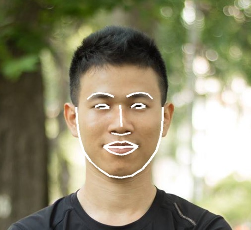

# FaceComp - phần mềm nhận diện khuôn mặt trên máy tính

FaceComp là phần mềm nhận diện khuôn mặt đóng gói thành DLL tích hợp vào .NET framework
 Example source code tích hợp module nhận diện khuôn mặt bằng Deep Learning.

# Cách build
Sử dụng Visual Studio 2017 trở lên để build source code example.

**FaceComp_Demo_x64.sln** build chương trình demo: cách đọc webcam, load hình ảnh, hiển thị kết quả, lưu database,...

**ConsoleCs.sln** code example đơn giản nhất về cách gọi hàm

# Các mã lỗi khi nhận diện

**200** Nhận diện thành công (không lỗi)

**204** Không tìm thấy khuôn mặt trong ảnh

**300** Có nhiều khuôn mặt trong ảnh (chỉ nhận diện khi chỉ có 1 khuôn mặt trong ảnh)

**400** Ảnh bị lỗi, không đọc được 

**401** Chưa được cấp quyền sử dụng phần mềm, vui lòng liên hệ 0939825125

**404** Không tìm thấy file ảnh

# Trang chủ

https://viscomsolution.com/phan-mem-nhan-dien-khuon-mat-tren-may-tinh/